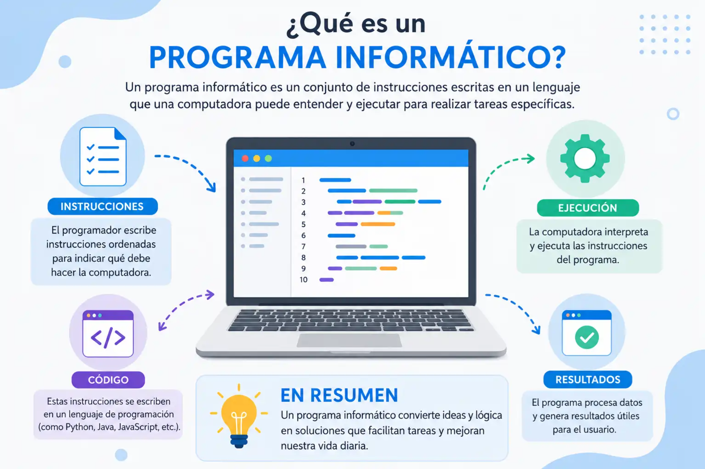

**Ejercicio 01 - Entornos de desarrollo**

#### ¿Qué es un programa informático?

Un programa de computadora es un conjunto de instrucciones que sigue una computadora para realizar una tarea específica. Estos programas están escritos en lenguajes de programación, como Python o Java, y pueden variar desde algo simple como una aplicación de calculadora hasta algo complejo como un sistema operativo.

\---

Fuente: [Aulascript](https://www.aulascript.com/programar/programas.htm)

#### Diferencia entre código fuente, código objeto y código ejecutable.

Código Fuente: Son las líneas de texto e instrucciones escritas por un humano en un lenguaje de programación (como C, Python o Java).
Características: Es totalmente legible para las personas, pero la computadora no lo entiende directamente.

Fuente: [S'Arreplec](https://sarreplec.caib.es/pluginfile.php/11297/mod_resource/content/10/ED01_Contenidos_Web/72_clasificacin_de_los_lenguajes_de_programacin.html)

Código Objeto: Es el resultado de traducir el código fuente a un formato binario (ceros y unos) mediante un compilador.
Características: No es legible para los humanos ni puede ejecutarse por sí mismo todavía, ya que suele faltarle la conexión con otras librerías o módulos. Sirve como paso previo.
Fuente: [Studocu](https://www.studocu.com/es/document/instituto-de-educacion-secundaria-poligono-sur/matematicas-ii/13codigos-fuente-objeto-y-ejecutable/104853597?sid=d14517e5-89e2-44b7-99d1-e79dec794d781790184231)

Código Ejecutable: Es el código máquina final que se obtiene al unir (enlazar) uno o más códigos objeto con la información y recursos necesarios.
Características: La computadora (el procesador y el sistema operativo) lo puede leer y correr de forma directa para que funcione el programa (por ejemplo, los archivos .exe en Windows).

Fuente: [Wikipedia](https://es.wikipedia.org/wiki/C%25C3%25B3digo_ejecutable)

#### Etapas del desarrollo del software.

1. Planificación: Se definen los objetivos del proyecto, se recopilan los requerimientos del cliente y se desarrolla un plan de proyecto.
2. Análisis: Se investigan sobre los requerimientos del cliente, se entrevista a los usuarios y se recopila información para entender la necesidad del usuario final.
3. Diseño: En esta etapa, se definen los componentes del software, la arquitectura del software y la interfaz de usuario.
4. Programación: es la etapa en la que se escribe el código del software según el diseño.
5. Pruebas: En esta etapa se realizan pruebas de funcionamiento, rendimiento, seguridad, entre otras para verificar que el software cumpla con los requerimientos del cliente.
6. Implementación: En esta etapa, se instala el software y se pone en funcionamiento dentro de los sistemas informáticos de los usuarios.
7. Mantenimiento: En esta etapa, se realizan actualizaciones del software para corregir errores, agregar nuevas características o mejorar el rendimiento.

Fuente: [Certus](https://www.certus.edu.pe/blog/las-etapas-del-desarrollo-de-software/)

Enlace al repositorio [Aquí.](https://github.com/anacona94/1DAMP_AnaconaNoguera_Frank/tree/main) 

